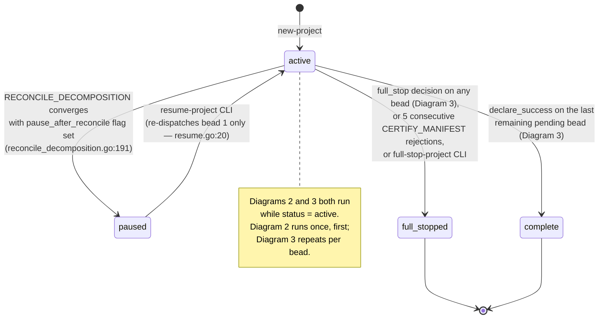
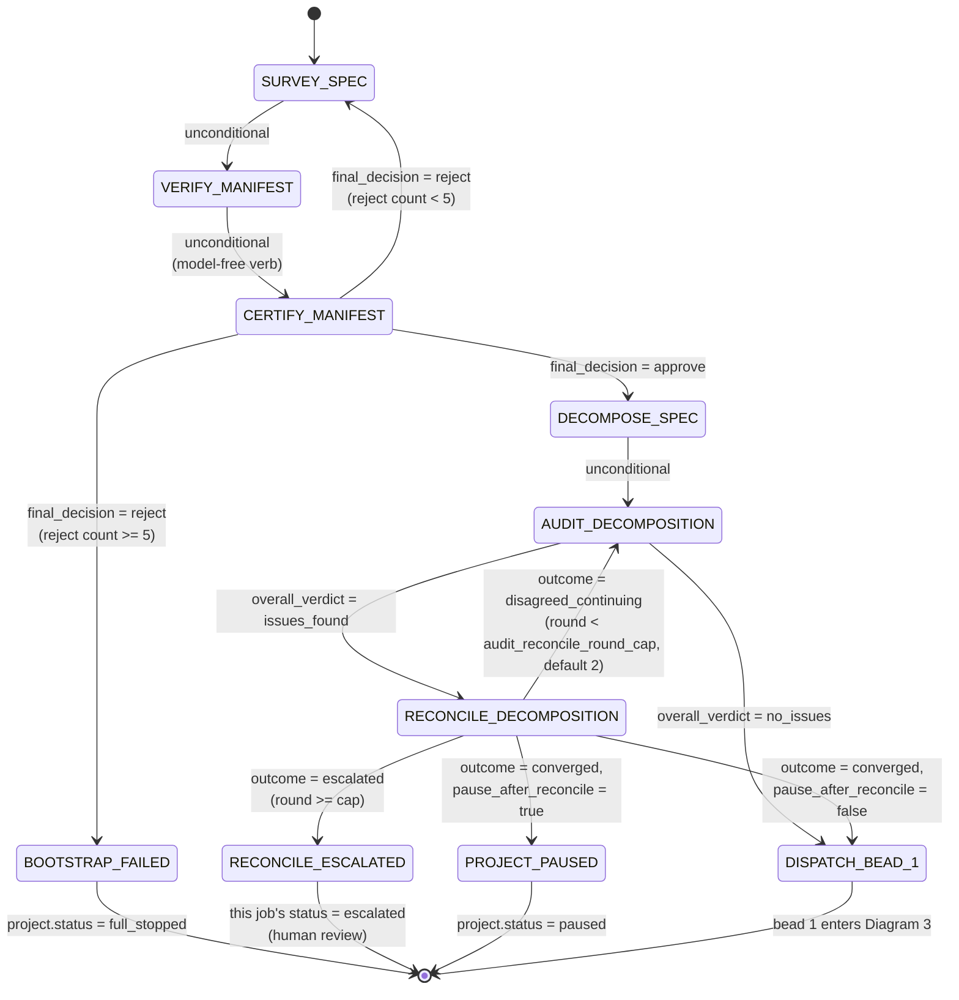
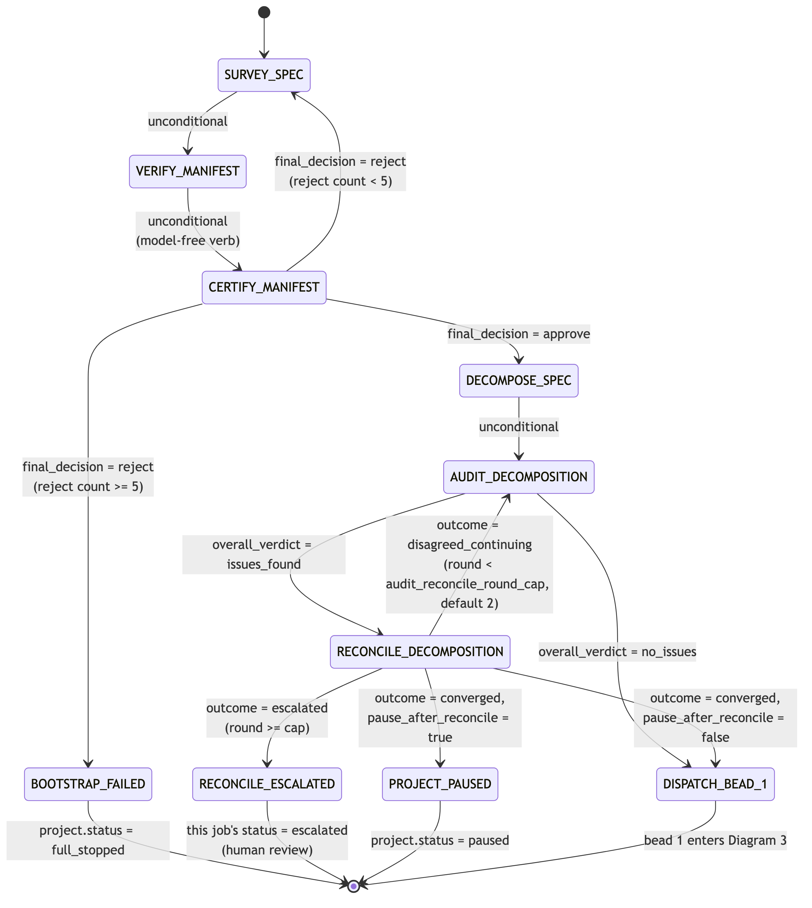
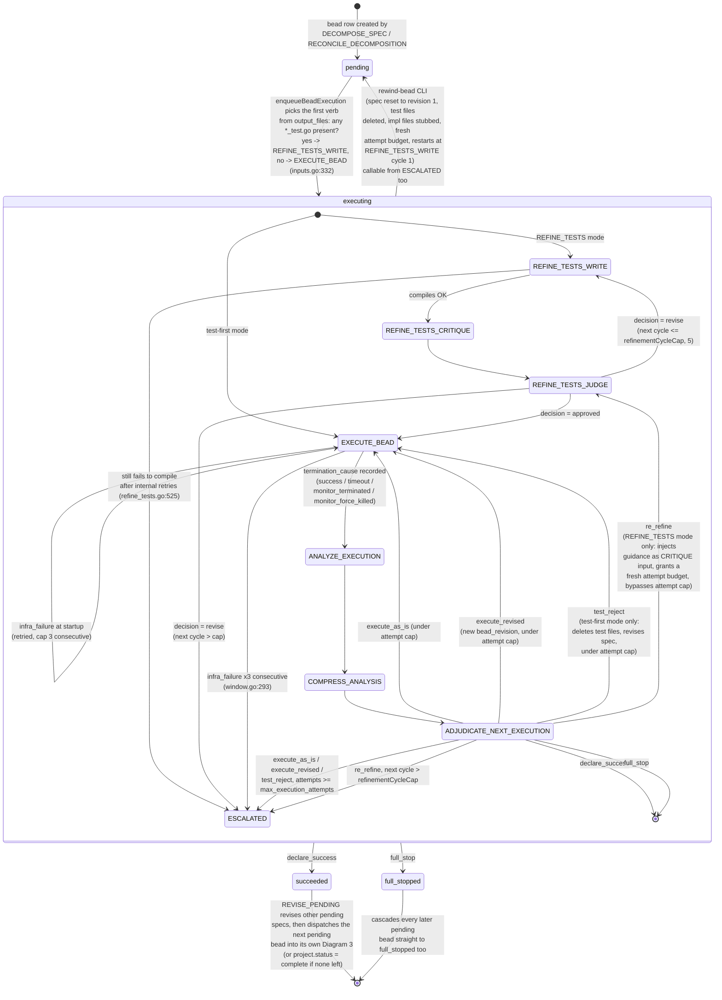
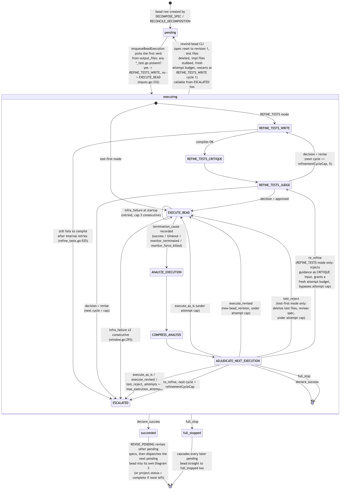
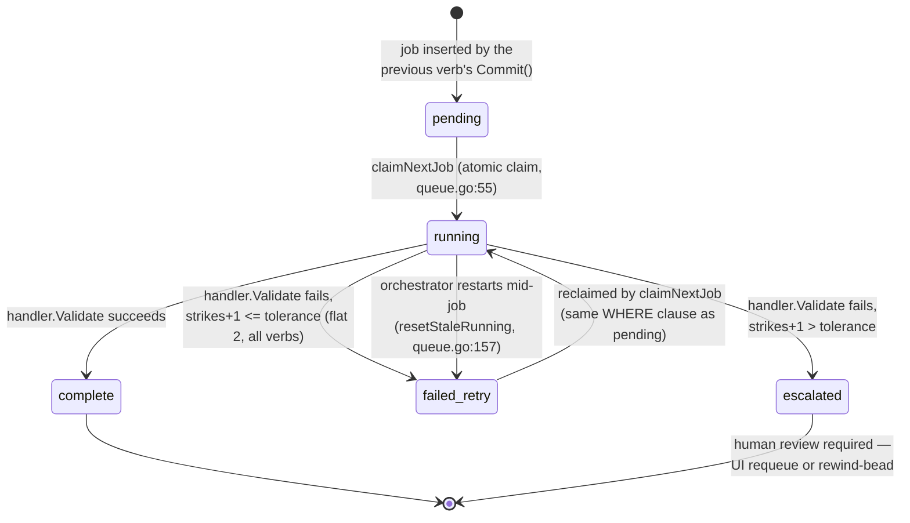
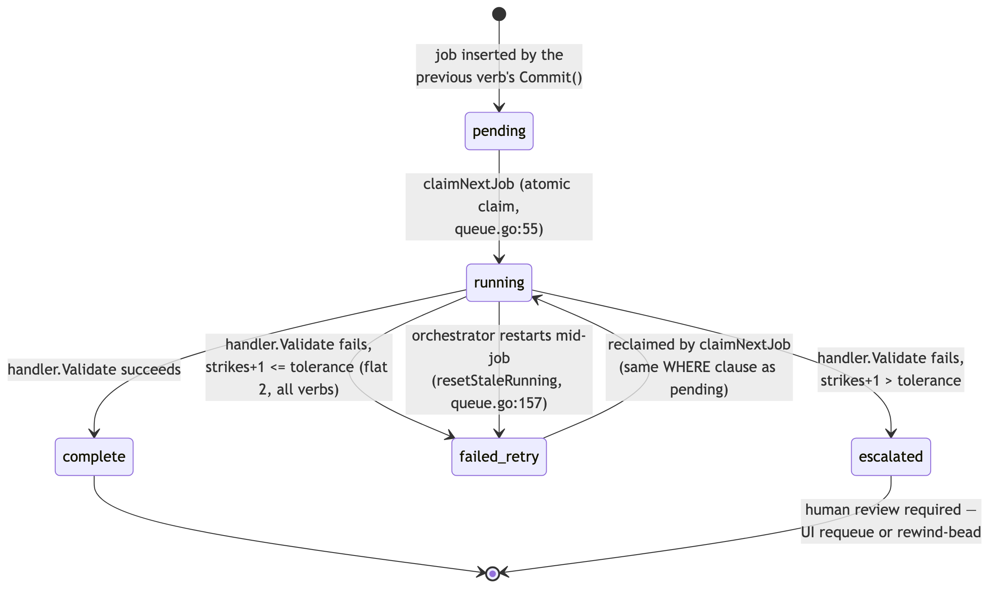

# Ratchet state machine

Four diagrams, from outermost to innermost:

1. **Project status** — the four values of `projects.status`.
2. **Bootstrap** — runs once per project, before any bead executes.
3. **Per-bead pipeline** — the loop every bead goes through; this is where most of the complexity lives.
4. **Generic job status** — the low-level `handoff_jobs.status` FSM that every verb call goes through underneath diagrams 2 and 3.

Render with a Mermaid-capable viewer (VS Code preview, GitHub, mermaid.live).

## 1. Project status

`projects.status CHECK IN ('active', 'full_stopped', 'complete', 'paused')` — schema.sql:10

## 2. Bootstrap (runs once, before bead 1)

All transitions are automatic (`Commit()` chaining one job into the next) except the two branch points marked with a verb's decision field.

Note: `AUDIT_DECOMPOSITION` with `no_issues` skips `RECONCILE_DECOMPOSITION` entirely — reconcile only runs when audit found something to fix.

## 3. Per-bead pipeline

Outer ring is `beads.status CHECK IN ('pending', 'executing', 'succeeded', 'full_stopped')` — schema.sql:38. Everything inside `executing` is the verb chain for one bead; `beads.status` itself doesn't change while looping inside that box (it flips `pending → executing` each time a fresh `EXECUTE_BEAD` job is actually claimed, and back to `pending` between an ADJUDICATE retry decision and the next claim — see `window.go:115` and the `execute_as_is`/`execute_revised`/`test_reject` branches).

**`MONITOR_EXECUTION` is not in this chain.** It's a parallel watchdog subprocess (`ratchet monitor`, spawned alongside `execute-bead` by `RunExecutionWindow`, `window.go:138`) that polls the trace file, asks its own model FIRE/NO_FIRE, and can SIGTERM/SIGKILL the running `EXECUTE_BEAD` process — which is how `termination_cause` becomes `monitor_terminated` or `monitor_force_killed`. It has no `handoff_jobs` row of its own.

## 4. Generic job status (underneath every verb above)

`handoff_jobs.status CHECK IN ('pending', 'running', 'failed_retry', 'escalated', 'complete')` — schema.sql:135. `escalated` and `complete` are the only terminal values for a job row.

`EXECUTE_BEAD` is special-cased in `dispatch.go:26`: it doesn't go through `Run`/`Validate`/`Commit` like other verbs, it calls `RunExecutionWindow` directly, and it doesn't accumulate strikes the same way — its own retry/escalation logic (infra-failure cap, monitor kill) lives inside `window.go` and is drawn separately in Diagram 3. `VERIFY_MANIFEST` is the only other verb skipped for model warmup (it's model-free).

## Escalation points (all 8, i.e. every way a job can reach `escalated` / `full_stopped` outside a normal decision)

| # | Where | Trigger | File:line |
|---|---|---|---|
| 1 | `RECONCILE_DECOMPOSITION` | audit/reconcile round cap reached with an unresolved disagreement | `reconcile_decomposition.go:~204` |
| 2 | `CERTIFY_MANIFEST` | 5 consecutive rejections | `certify_manifest.go:203` |
| 3 | `REFINE_TESTS_WRITE` | test file still fails to compile after internal retries | `refine_tests.go:525` |
| 4 | `REFINE_TESTS_JUDGE` | revise requested after `refinementCycleCap` (5) reached | `refine_tests.go:702` |
| 5 | `EXECUTE_BEAD` (via `window.go`) | 3 consecutive infra-failure crashes at startup | `window.go:293` |
| 6 | `ADJUDICATE_NEXT_EXECUTION` | `execute_as_is`/`execute_revised`/`test_reject` at `max_execution_attempts` | `adjudicate_next_execution.go` `atExecutionCap` |
| 7 | `ADJUDICATE_NEXT_EXECUTION` | `re_refine` past `refinementCycleCap` | `adjudicate_next_execution.go:~884` |
| 8 | any verb (generic) | strikes exceed flat tolerance of 2 on malformed/invalid output | `orchestrator/dispatch.go:~103` |

`rewind-bead` is the sanctioned recovery path for any of these while the bead hasn't succeeded — it resets to `REFINE_TESTS_WRITE` cycle 1 and stubs impl files, so it always discards whatever implementation exists on disk. `resume-project` only ever re-dispatches bead 1, and `full-stop-project` is the manual equivalent of escalation path #6/7 applied project-wide.