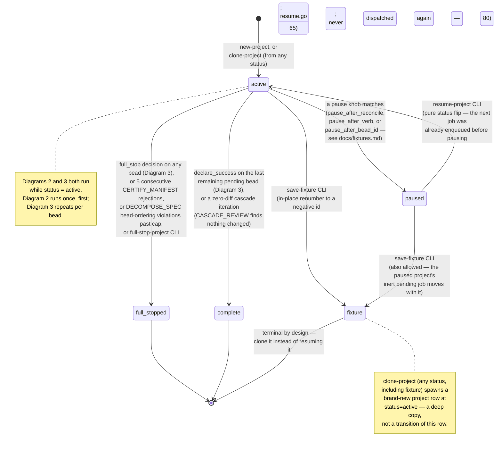
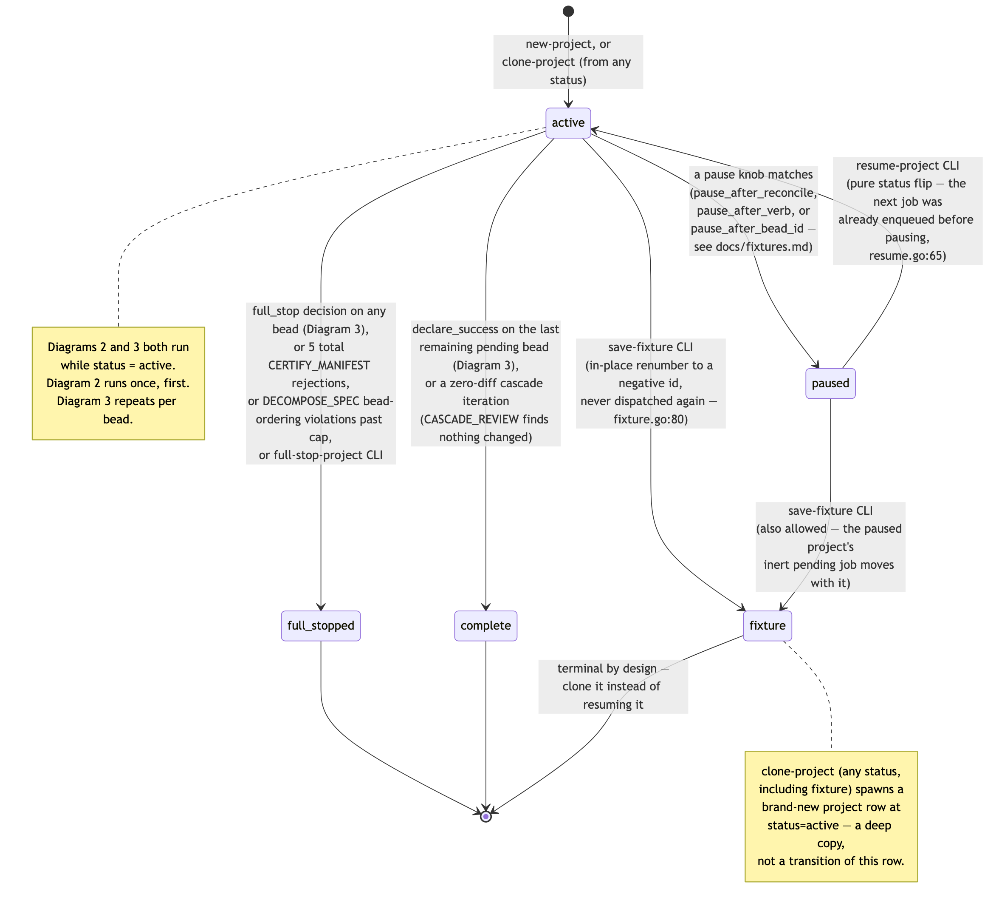
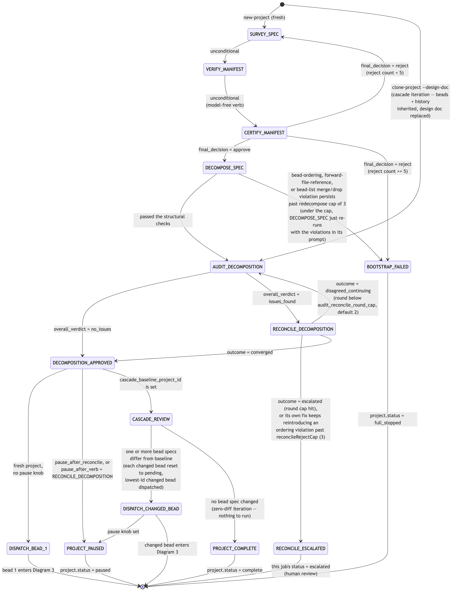
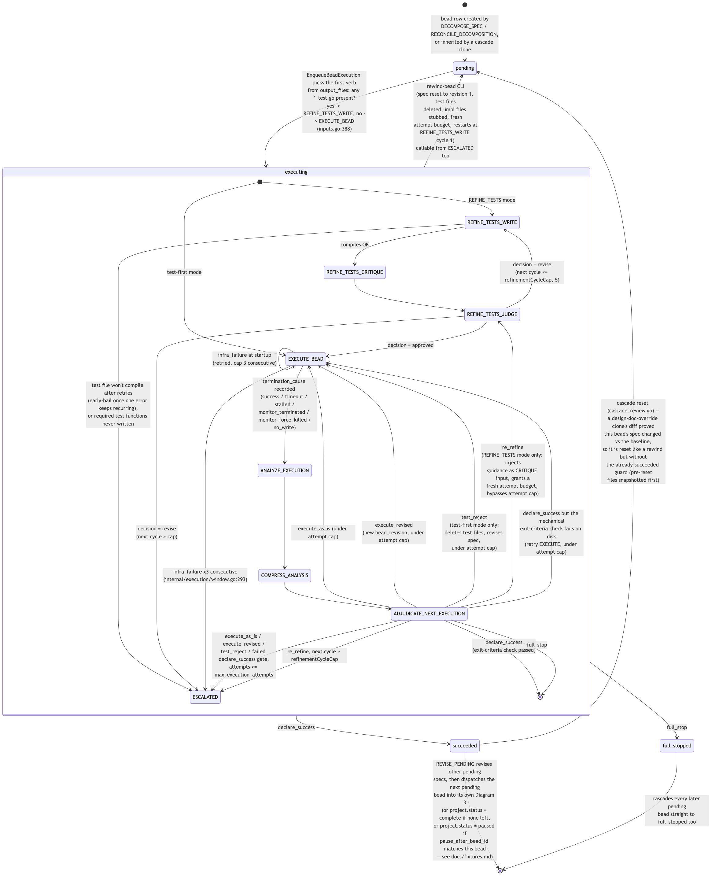
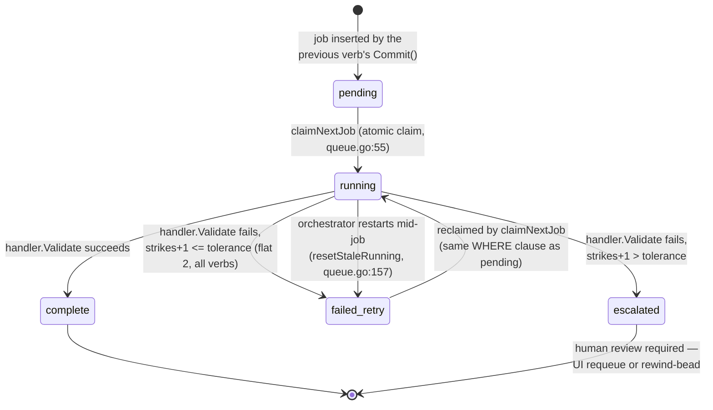
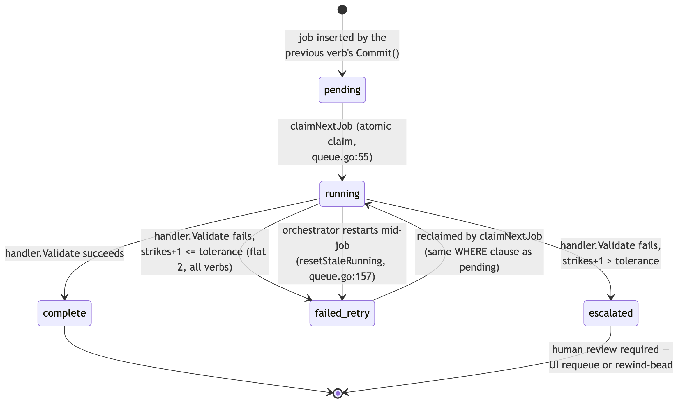

# Ratchet state machine

Four diagrams, from outermost to innermost:

1. **Project status** — the five values of `projects.status`.
2. **Bootstrap** — runs once per project, before any bead executes. Has two entry
   points now: a fresh `new-project` starts at `SURVEY_SPEC`; a cascade iteration
   (`clone-project --design-doc`) starts at `AUDIT_DECOMPOSITION` against inherited
   beads.
3. **Per-bead pipeline** — the loop every bead goes through; this is where most of the complexity lives.
4. **Generic job status** — the low-level `handoff_jobs.status` FSM that every verb call goes through underneath diagrams 2 and 3.

Render with a Mermaid-capable viewer (VS Code preview, GitHub, mermaid.live).

See `docs/fixtures.md` for the `fixture` status, the three pause knobs, and the
`save-fixture`/`clone-project` workflow. See the **Cascade iterations** section at the
bottom of this file for the loop-mode `clone-project --design-doc` flow.

## 1. Project status

`projects.status CHECK IN ('active', 'full_stopped', 'complete', 'paused', 'fixture')` — schema.sql:10. `fixture` was added alongside the fixture/clone workflow — see `docs/fixtures.md`.

Provenance columns on `projects` (not status, but they decide which bootstrap path a
row takes): `recovered_from_project_id` (set by the old recovery flow),
`lineage_root_id` + `iteration_number` (every project belongs to a lineage; a plain
clone keeps the root and increments the number), and `cascade_baseline_project_id`
(set **only** by `clone-project --design-doc` — its presence is what makes bootstrap
run the cascade path).

```mermaid
stateDiagram-v2
    [*] --> active : new-project, or<br/>clone-project (from any status)
    active --> paused : a pause knob matches<br/>(pause_after_reconcile,<br/>pause_after_verb, or<br/>pause_after_bead_id —<br/>see docs/fixtures.md)
    paused --> active : resume-project CLI<br/>(pure status flip — the next job was<br/>already enqueued before pausing;<br/>resume.go:65)
    active --> full_stopped : full_stop decision on any bead (Diagram 3),<br/>or 5 consecutive CERTIFY_MANIFEST rejections,<br/>or DECOMPOSE_SPEC bead-ordering violations past cap,<br/>or full-stop-project CLI
    active --> complete : declare_success on the last<br/>remaining pending bead (Diagram 3),<br/>or a zero-diff cascade iteration<br/>(CASCADE_REVIEW finds nothing changed)
    active --> fixture : save-fixture CLI<br/>(in-place renumber to a negative id;<br/>never dispatched again — fixture.go:80)
    paused --> fixture : save-fixture CLI<br/>(also allowed — the paused project's<br/>inert pending job moves with it)
    full_stopped --> [*]
    complete --> [*]
    fixture --> [*] : terminal by design —<br/>clone it instead of resuming it

    note right of active
      Diagrams 2 and 3 both run
      while status = active.
      Diagram 2 runs once, first;
      Diagram 3 repeats per bead.
    end note

    note right of fixture
      clone-project (any status,
      including fixture) spawns a
      brand-new project row at
      status=active — a deep copy,
      not a transition of this row.
    end note
```

 — **stale**: predates the `fixture` status, the generalized pause knobs, and the cascade path. Regenerate from the Mermaid source above next time the PNGs are refreshed.

## 2. Bootstrap (runs once, before bead 1)

Two entry points. A fresh `new-project` starts at `SURVEY_SPEC`. A cascade iteration
(`clone-project --design-doc`, which inherits the baseline project's beads and full
execution history and only swaps the design doc) skips `SURVEY_SPEC`/`DECOMPOSE_SPEC`
and starts at `AUDIT_DECOMPOSITION` — the inherited beads are what AUDIT now reviews
against the replaced design doc (`clone.go:384`).

All transitions are automatic (`Commit()` chaining one job into the next) except the branch points marked with a verb's decision field. `DECOMPOSITION_APPROVED` is not a verb — it is the shared checkpoint (`enqueueDecompositionApproved`, inputs.go:450) that both the AUDIT-`no_issues` and RECONCILE-`converged` paths funnel through.

```mermaid
stateDiagram-v2
    [*] --> SURVEY_SPEC : new-project (fresh)
    [*] --> AUDIT_DECOMPOSITION : clone-project --design-doc<br/>(cascade iteration — beads + history<br/>inherited, design doc replaced)

    SURVEY_SPEC --> VERIFY_MANIFEST : unconditional
    VERIFY_MANIFEST --> CERTIFY_MANIFEST : unconditional<br/>(model-free verb)
    CERTIFY_MANIFEST --> DECOMPOSE_SPEC : final_decision = approve
    CERTIFY_MANIFEST --> SURVEY_SPEC : final_decision = reject<br/>(reject count < 5)
    CERTIFY_MANIFEST --> BOOTSTRAP_FAILED : final_decision = reject<br/>(reject count >= 5)

    DECOMPOSE_SPEC --> AUDIT_DECOMPOSITION : passed the forward<br/>file-reference check
    DECOMPOSE_SPEC --> DECOMPOSE_SPEC : bead-ordering violation<br/>(mechanical; redecompose round,<br/>attempt < decomposeRedecomposeCap = 3)
    DECOMPOSE_SPEC --> BOOTSTRAP_FAILED : bead-ordering violation<br/>persists at redecompose cap

    AUDIT_DECOMPOSITION --> DECOMPOSITION_APPROVED : overall_verdict = no_issues
    AUDIT_DECOMPOSITION --> RECONCILE_DECOMPOSITION : overall_verdict = issues_found
    RECONCILE_DECOMPOSITION --> AUDIT_DECOMPOSITION : outcome = disagreed_continuing<br/>(round < audit_reconcile_round_cap, default 2)
    RECONCILE_DECOMPOSITION --> RECONCILE_ESCALATED : outcome = escalated<br/>(round >= cap)
    RECONCILE_DECOMPOSITION --> RECONCILE_DECOMPOSITION : its own fix reintroduces a<br/>bead-ordering violation<br/>(reconcile_rejected round,<br/>attempt < reconcileRejectCap = 3)
    RECONCILE_DECOMPOSITION --> RECONCILE_ESCALATED : reconcile_rejected persists at cap
    RECONCILE_DECOMPOSITION --> DECOMPOSITION_APPROVED : outcome = converged

    DECOMPOSITION_APPROVED --> DISPATCH_BEAD_1 : fresh project,<br/>no pause knob
    DECOMPOSITION_APPROVED --> PROJECT_PAUSED : pause_after_reconcile, or<br/>pause_after_verb = RECONCILE_DECOMPOSITION
    DECOMPOSITION_APPROVED --> CASCADE_REVIEW : cascade_baseline_project_id is set

    CASCADE_REVIEW --> DISPATCH_CHANGED_BEAD : >= 1 bead's spec differs from baseline<br/>(each changed bead reset to pending;<br/>lowest-id changed bead dispatched)
    CASCADE_REVIEW --> PROJECT_COMPLETE : no bead's spec changed<br/>(zero-diff iteration — nothing to run)
    DISPATCH_CHANGED_BEAD --> PROJECT_PAUSED : pause knob set
    DISPATCH_CHANGED_BEAD --> [*] : changed bead enters Diagram 3

    BOOTSTRAP_FAILED --> [*] : project.status = full_stopped
    RECONCILE_ESCALATED --> [*] : this job's status = escalated<br/>(human review)
    PROJECT_PAUSED --> [*] : project.status = paused
    PROJECT_COMPLETE --> [*] : project.status = complete
    DISPATCH_BEAD_1 --> [*] : bead 1 enters Diagram 3
```

 — predates the cascade path and the two mechanical redecompose/reconcile-rejected self-loops.

Notes:
- `AUDIT_DECOMPOSITION` with `no_issues` skips `RECONCILE_DECOMPOSITION` — reconcile only runs when audit found something to fix.
- The `redecompose` / `reconcile_rejected` self-loops are mechanical, not model
  judgment: a forward file-reference / bead-ordering check runs on the proposed
  decomposition, and a violation bounces the verb with the violations rendered into
  its next prompt.

## 3. Per-bead pipeline

Outer ring is `beads.status CHECK IN ('pending', 'executing', 'succeeded', 'full_stopped')` — schema.sql:45. Everything inside `executing` is the verb chain for one bead; `beads.status` itself doesn't change while looping inside that box (it flips `pending → executing` each time a fresh `EXECUTE_BEAD` job is actually claimed, and back to `pending` between an ADJUDICATE retry decision and the next claim — see `internal/execution/window.go:115` and the `execute_as_is`/`execute_revised`/`test_reject` branches).

```mermaid
stateDiagram-v2
    [*] --> pending : bead row created by<br/>DECOMPOSE_SPEC / RECONCILE_DECOMPOSITION,<br/>or inherited by a cascade clone

    pending --> executing : EnqueueBeadExecution picks the first verb<br/>from output_files: any *_test.go present?<br/>yes -> REFINE_TESTS_WRITE, no -> EXECUTE_BEAD<br/>(inputs.go:388)

    state executing {
        [*] --> REFINE_TESTS_WRITE : REFINE_TESTS mode
        [*] --> EXECUTE_BEAD : test-first mode

        REFINE_TESTS_WRITE --> REFINE_TESTS_CRITIQUE : compiles OK
        REFINE_TESTS_WRITE --> ESCALATED : still fails to compile<br/>after internal retries (refine_tests.go:~679)
        REFINE_TESTS_CRITIQUE --> REFINE_TESTS_JUDGE
        REFINE_TESTS_JUDGE --> EXECUTE_BEAD : decision = approved
        REFINE_TESTS_JUDGE --> REFINE_TESTS_WRITE : decision = revise<br/>(next cycle <= refinementCycleCap, 5)
        REFINE_TESTS_JUDGE --> ESCALATED : decision = revise<br/>(next cycle > cap)

        EXECUTE_BEAD --> EXECUTE_BEAD : infra_failure at startup<br/>(retried, cap 3 consecutive)
        EXECUTE_BEAD --> ESCALATED : infra_failure x3 consecutive<br/>(internal/execution/window.go:293)
        EXECUTE_BEAD --> ANALYZE_EXECUTION : termination_cause recorded<br/>(success / timeout /<br/>monitor_terminated / monitor_force_killed /<br/>no_write)

        ANALYZE_EXECUTION --> COMPRESS_ANALYSIS
        COMPRESS_ANALYSIS --> ADJUDICATE_NEXT_EXECUTION

        ADJUDICATE_NEXT_EXECUTION --> EXECUTE_BEAD : execute_as_is (under attempt cap)
        ADJUDICATE_NEXT_EXECUTION --> EXECUTE_BEAD : execute_revised<br/>(new bead_revision, under attempt cap)
        ADJUDICATE_NEXT_EXECUTION --> EXECUTE_BEAD : test_reject<br/>(test-first mode only:<br/>deletes test files, revises spec,<br/>under attempt cap)
        ADJUDICATE_NEXT_EXECUTION --> REFINE_TESTS_JUDGE : re_refine<br/>(REFINE_TESTS mode only: injects<br/>guidance as CRITIQUE input, grants a<br/>fresh attempt budget, bypasses attempt cap)
        ADJUDICATE_NEXT_EXECUTION --> ESCALATED : execute_as_is / execute_revised /<br/>test_reject, attempts >= max_execution_attempts
        ADJUDICATE_NEXT_EXECUTION --> ESCALATED : re_refine, next cycle > refinementCycleCap
        ADJUDICATE_NEXT_EXECUTION --> [*] : declare_success
        ADJUDICATE_NEXT_EXECUTION --> [*] : full_stop
    }

    executing --> succeeded : declare_success
    executing --> full_stopped : full_stop
    executing --> pending : rewind-bead CLI<br/>(spec reset to revision 1, test files<br/>deleted, impl files stubbed, fresh<br/>attempt budget, restarts at<br/>REFINE_TESTS_WRITE cycle 1)<br/>callable from ESCALATED too
    succeeded --> pending : cascade reset (cascade_review.go)<br/>a design-doc-override clone's diff proved<br/>this bead's spec changed vs the baseline —<br/>like rewind but bypasses the "already<br/>succeeded" guard; snapshot under<br/>traces/bead-{id}-cascade-{n}/

    succeeded --> [*] : REVISE_PENDING revises other pending<br/>specs, then dispatches the next pending<br/>bead into its own Diagram 3<br/>(or project.status = complete if none left,<br/>or project.status = paused if<br/>pause_after_bead_id matches this bead<br/>— see docs/fixtures.md)
    full_stopped --> [*] : cascades every later pending<br/>bead straight to full_stopped too
```

**`MONITOR_EXECUTION` is not in this chain.** It's a parallel watchdog subprocess (`ratchet monitor`, spawned alongside `execute-bead` by `RunExecutionWindow`, `internal/execution/window.go:149`) that polls the trace file, asks its own model FIRE/NO_FIRE, and can SIGTERM/SIGKILL the running `EXECUTE_BEAD` process — which is how `termination_cause` becomes `monitor_terminated` or `monitor_force_killed`. It has no `handoff_jobs` row of its own.

**Cascade reset vs. rewind.** Both send a bead back to `pending` and stub its impl
files. `rewind-bead` is a human recovery action reacting to a stuck/escalated bead and
refuses to touch a `succeeded` one. The cascade reset (`resetBeadForRerun`) is
automatic during a `clone-project --design-doc` bootstrap: it has a mechanical diff
proving the spec changed, so it resets `succeeded` beads too. Both snapshot the
pre-reset files first (`SnapshotBeadFiles`).

## 4. Generic job status (underneath every verb above)

`handoff_jobs.status CHECK IN ('pending', 'running', 'failed_retry', 'escalated', 'complete')` — schema.sql:156. `escalated` and `complete` are the only terminal values for a job row.

```mermaid
stateDiagram-v2
    [*] --> pending : job inserted by the<br/>previous verb's Commit()
    pending --> running : claimNextJob (atomic claim,<br/>queue.go:55)
    running --> complete : handler.Validate succeeds
    running --> failed_retry : handler.Validate fails,<br/>strikes+1 <= tolerance (flat 2, all verbs)
    running --> escalated : handler.Validate fails,<br/>strikes+1 > tolerance
    running --> failed_retry : orchestrator restarts mid-job<br/>(resetStaleRunning, queue.go:157)
    failed_retry --> running : reclaimed by claimNextJob<br/>(same WHERE clause as pending)
    complete --> [*]
    escalated --> [*] : human review required —<br/>UI requeue or rewind-bead
```

`EXECUTE_BEAD` is special-cased in `dispatch.go:~45`: it doesn't go through `Run`/`Validate`/`Commit` like other verbs, it calls `RunExecutionWindow` directly, and it doesn't accumulate strikes the same way — its own retry/escalation logic (infra-failure cap, monitor kill) lives inside `internal/execution/window.go` and is drawn separately in Diagram 3. `VERIFY_MANIFEST` is the only other verb skipped for model warmup (it's model-free). The strike tolerance is a flat `2` for every verb (`verbTolerance`, `queue.go:19`).

## Escalation points (every way a job reaches `escalated` / a project reaches `full_stopped` outside a normal decision)

| # | Where | Trigger | Result | File:line |
|---|---|---|---|---|
| 1 | `RECONCILE_DECOMPOSITION` | audit/reconcile round cap reached with an unresolved disagreement (`outcome = escalated`) | job escalated | `reconcile_decomposition.go:~300` |
| 2 | `CERTIFY_MANIFEST` | 5 rejections total | project full_stopped | `certify_manifest.go:~211` |
| 3 | `REFINE_TESTS_WRITE` | test file still fails to compile after internal retries | job escalated | `refine_tests.go:~679` |
| 4 | `REFINE_TESTS_JUDGE` | revise requested after `refinementCycleCap` (5) reached | job escalated | `refine_tests.go:~1284` |
| 5 | `EXECUTE_BEAD` (via execution window) | `infraFailureCap` (3) consecutive startup crashes | job escalated | `internal/execution/window.go:293` |
| 6 | `ADJUDICATE_NEXT_EXECUTION` | `execute_as_is`/`execute_revised`/`test_reject` at `max_execution_attempts` (`atExecutionCap`) | job escalated | `adjudicate_next_execution.go:~1469` |
| 7 | `ADJUDICATE_NEXT_EXECUTION` | `re_refine` past `refinementCycleCap` | job escalated | `adjudicate_next_execution.go:~1293` |
| 8 | any verb (generic) | strikes exceed flat tolerance of 2 on malformed/invalid output | job escalated | `orchestrator/dispatch.go:~113` |
| 9 | `DECOMPOSE_SPEC` | bead-ordering / forward-file-reference violations persist to `decomposeRedecomposeCap` (3) | project full_stopped | `decompose_spec.go:~259` |
| 10 | `RECONCILE_DECOMPOSITION` | its own proposed fix keeps reintroducing an ordering violation to `reconcileRejectCap` (3) | job escalated | `reconcile_decomposition.go:~464` |

`rewind-bead` is the sanctioned recovery path for any of the per-bead escalations while the bead hasn't succeeded — it resets to `REFINE_TESTS_WRITE` cycle 1 and stubs impl files, so it always discards whatever implementation exists on disk. `resume-project` only ever re-dispatches bead 1 (or, for a cascade project, re-enters through `enqueueDecompositionApproved`). `full-stop-project` is the manual equivalent of a project-wide escalation.

## Cascade iterations (loop-mode)

`clone-project --design-doc <new.md>` creates a new project in the same lineage
(`lineage_root_id` kept, `iteration_number` + 1) that inherits the baseline project's
beads, `bead_revisions`, and full execution/adjudication history wholesale, then
overwrites the design doc and sets `cascade_baseline_project_id` to the baseline's id.

Bootstrap for that project:

1. A single fresh `AUDIT_DECOMPOSITION` job is enqueued (`clone.go:384`). `SURVEY_SPEC`
   and `DECOMPOSE_SPEC` never run — the inherited beads are the decomposition.
2. `AUDIT_DECOMPOSITION` → (`RECONCILE_DECOMPOSITION` loop if needed) → converge, all
   against the **new** design doc. RECONCILE may not rename, add, or remove beads, so
   bead titles are stable across the clone boundary.
3. At `DECOMPOSITION_APPROVED`, because `cascade_baseline_project_id` is set,
   `enqueueCascadeReview` runs instead of dispatching bead 1
   (`inputs.go:450` → `cascade_review.go`).
4. For each bead, its now-approved spec (`full_text` + `execution_budget` +
   `monitor_override`) is compared by title against the baseline's. Comparison is
   deliberately liberal — any textual diff counts (a stale artifact silently surviving
   a real change is worse than an unnecessary re-run).
5. Every **changed** bead is reset by `resetBeadForRerun` — including ones already
   `succeeded` under the clone — to a clean, re-runnable `pending` state: active jobs
   cancelled, `execution_attempts_override` cleared to the project default, test files
   deleted, impl files reset to scaffold stubs, `test_refinements` /
   `compressed_history` cleared, executions/analyses/adjudications left as superseded
   history. A pre-reset snapshot lands under `traces/bead-{id}-cascade-{n}/`.
6. **Unchanged** beads are left exactly as cloned — status, files, and history
   untouched.
7. If ≥ 1 bead changed, the lowest-id changed bead's execution is enqueued (then the
   normal pause-knob check applies). If **no** bead changed, the project is marked
   `complete` directly — no pause, nothing to resume into.

From step 7 onward a cascade project runs Diagram 3 normally; `REVISE_PENDING` walks
the remaining pending (changed) beads in id order.
