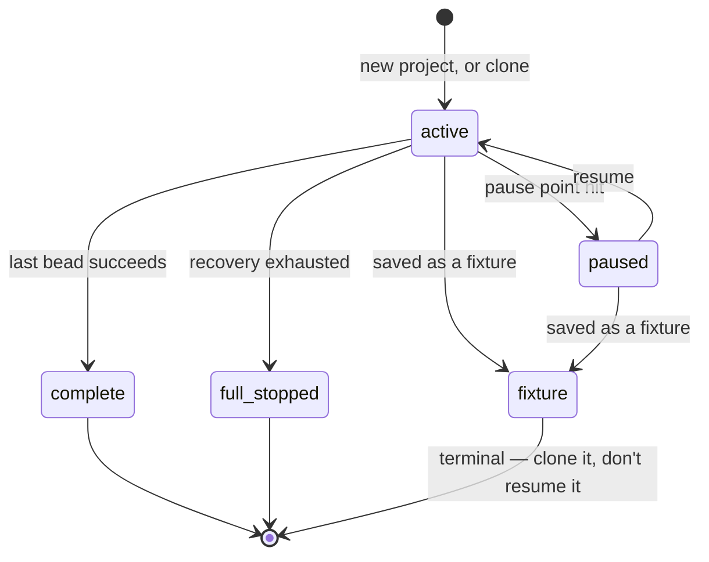
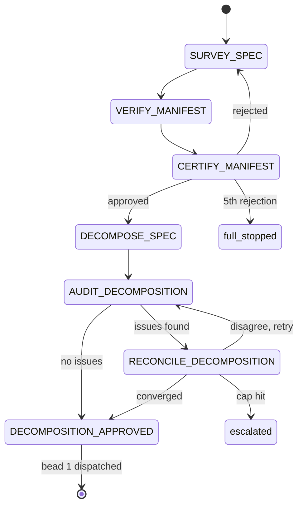
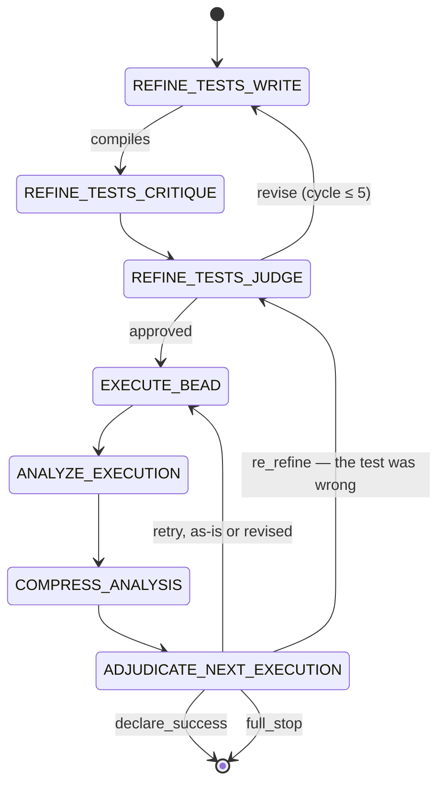
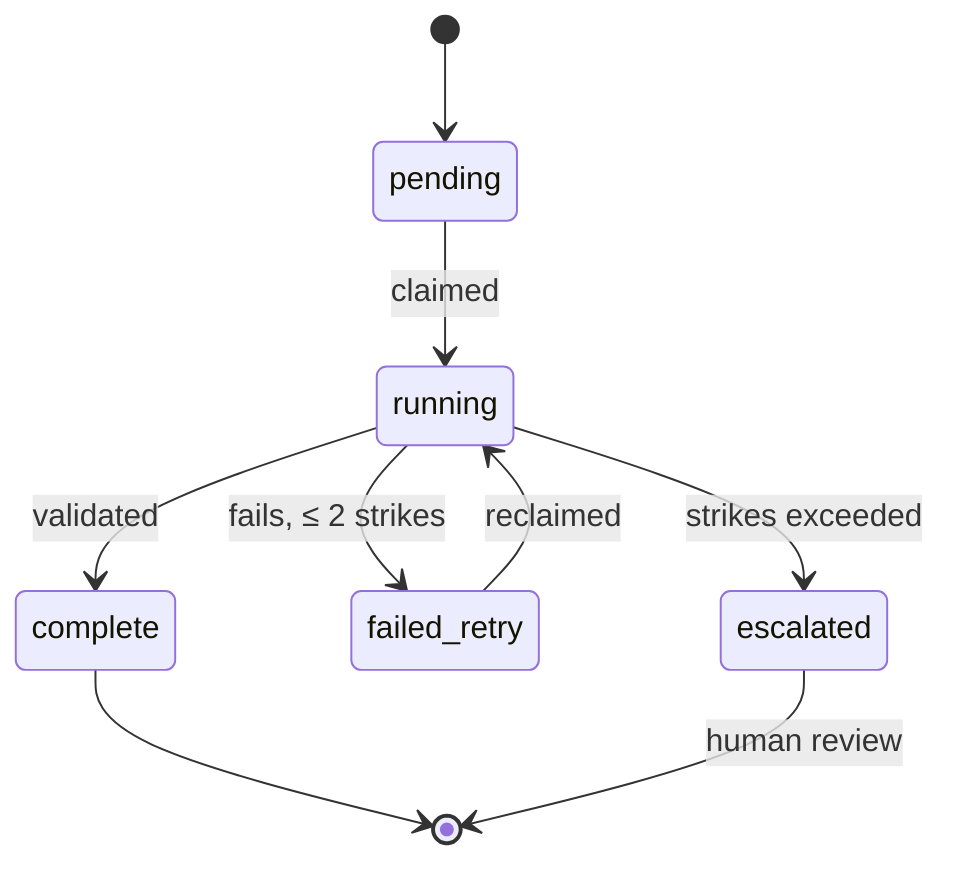

*Second in a series on Ratchet — a pipeline that turns design docs into working code using a fleet of small, locally-hosted language models. [The first piece](https://claude.ai/code/artifact/168dda2b-2945-41dc-920e-abc5458b22a4) covers what Ratchet is and why local models change everything; this one is the architecture, in the detail that lets you argue with it.*

Two quick definitions, if you're arriving here first: a **design doc** is a plain-English spec; Ratchet breaks it into **beads**, small independently-verifiable units of work, and drives each one through a fixed sequence of narrow model calls called **verbs**. Everything else in this piece is about how that actually works.

## The database is the ground truth

Before the state machines, one design decision that makes everything else possible: Ratchet is not a long-running agent process with state in memory. It's a SQLite database and a daemon that repeatedly asks it "what's the next job to run?" Every project, every bead, every model call, every decision a model made and why, lives in a row somewhere — `projects`, `beads`, `bead_revisions`, `handoff_jobs`, `executions`, `adjudications`, `test_refinements`.

This sounds like plumbing, but it's the reason two things later in this piece are possible at all: an operator can recover a stuck project by querying a table instead of reading scrollback, and a whole benchmarking harness can exist that replays a real historical decision against a candidate model, because "what actually happened" is a row, not a memory that evaporated when the process exited.

## Four state machines, nested

Ratchet's control flow is documented as four Mermaid diagrams, outermost to innermost. It's worth walking through them in order, because each layer exists to answer a specific question the layer above it can't.

**1. Project status.** A project is `active`, `paused`, `full_stopped`, `complete`, or `fixture` (a frozen, never-dispatched snapshot used for testing the framework itself — more on that later). Most of a project's life is spent `active`; the interesting transitions are `active → full_stopped` (something failed past its recovery budget) and `active → complete` (every bead succeeded).

**2. Bootstrap — runs once, before any bead executes.** A fresh project starts at `SURVEY_SPEC` (read the design doc and the existing codebase) and moves through `VERIFY_MANIFEST` → `CERTIFY_MANIFEST` → `DECOMPOSE_SPEC` → `AUDIT_DECOMPOSITION` → (`RECONCILE_DECOMPOSITION` if needed) → `DECOMPOSITION_APPROVED`, at which point bead 1 gets dispatched. Two of those steps are worth pulling out:

- `VERIFY_MANIFEST` is the one verb in the entire pipeline that's **model-free** — a mechanical check on the survey's output, not a model call at all. Not everything needs a model; where a check can be code, it is code.
- `AUDIT_DECOMPOSITION` is a second model reviewing the *plan* before any code gets written — does this decomposition actually cover the design doc, are the beads ordered so nothing depends on something built later? If it disagrees, `RECONCILE_DECOMPOSITION` negotiates a fix, capped at two rounds before the disagreement escalates for a human. This is the same principle as CRITIQUE-vs-WRITE below, one level up: whoever draws the plan doesn't get to be the only one who signs off on it.

Both of the retry loops in this stage are governed by a mechanical check, not a model's opinion: a decomposition that references a file before the bead that creates it, or reorders beads inconsistently, fails a structural test regardless of which model produced it. `DECOMPOSE_SPEC` gets three chances to fix it before the project is `full_stopped`; `RECONCILE_DECOMPOSITION` gets three chances at its own proposed fix before that job escalates.

**3. The per-bead pipeline — where most of the complexity lives.** This is the sequence from the overview, drawn out with its actual branches:

Two details matter more than the diagram shows. First, `test_reject` only exists in "test-first" mode (a bead that starts straight at `EXECUTE_BEAD` because it already has test files from somewhere else) — for the common `REFINE_TESTS` mode, a genuinely bad test is never something `EXECUTE_BEAD`'s retry loop is allowed to silently patch around; it has to go back through `re_refine` into the review chain above. Second, `re_refine` deliberately **bypasses** the normal per-bead attempt cap and grants a fresh budget, because the framework's own accounting treats "the test was wrong" as a different kind of failure than "the model couldn't implement a correct test" — conflating the two would either give bad tests unlimited retries or punish good implementations for someone else's mistake.

**4. Generic job status, underneath everything.** Every verb call is a row that goes `pending → running → complete`, with `failed_retry` (two strikes tolerated, flat across every verb) and `escalated` (strikes exceeded, or a terminal decision reached) as the only ways out besides success. `EXECUTE_BEAD` is the one exception — it doesn't go through this generic path at all; it runs as its own supervised subprocess with its own retry accounting, described next.

## The mechanical gates

The single organizing principle underneath all four diagrams: **a model's account of what happened is never sufficient on its own.** A few concrete instances, because the specifics are more convincing than the principle:

- **`declare_success` gets checked, not trusted.** When `ADJUDICATE_NEXT_EXECUTION` decides a bead is done, that decision triggers `VerifyExitCriteria` — literally re-running the bead's exit-criteria command against the files on disk. If it doesn't actually pass, the "success" is rejected and the bead goes back for another execution attempt instead of being marked done on a model's word.
- **`execute_revised` gets a source-side gate before it's allowed to commit.** A model can decide the bead's spec needs revising, but the proposed revision is checked mechanically first — does it reference a test function by a name that doesn't exist, or grep-match a file the bead doesn't own? A violation doesn't escalate the whole thing; it silently **downgrades to `execute_as_is`** — retry against the current, unmodified spec rather than commit a broken one.
- **A stuck execution gets classified, not just retried harder.** Timing is fixed, not budget-derived — a 12-minute soft checkpoint, a 45-minute hard ceiling — and a tracker judges each turn "productive" only if it leaves a file at content it hasn't held before this attempt, not just any write. What ends the attempt gets labeled one of two ways depending on what actually happened: `timeout` (real progress was happening, just too slowly — read as a signal to narrow the bead's scope, never as a reason to grant more time) or `stalled` (no real progress — several faster checks, like three identical tool calls in a row, can call this well before the hard ceiling ever fires). An earlier version of this mechanism tried granting more time on repeated timeouts; it was retired once a later bakeoff (below) independently confirmed the same lesson from a different angle — a struggling model given more room mostly just thrashes longer, it doesn't converge.
- **A parallel watchdog process can kill a running execution outright.** `MONITOR_EXECUTION` isn't a step in the chain above — it's a separate subprocess spawned alongside every `EXECUTE_BEAD`, polling a trace file and asking its own (small, cheap) model a yes/no "should this be killed?" on a schedule. If it fires, it can `SIGTERM` or `SIGKILL` the running execution — which is how a termination cause becomes `monitor_terminated` or `monitor_force_killed` rather than a plain timeout. It's a second opinion running concurrently with the thing it's watching, with no `handoff_jobs` row of its own.

None of these are exotic — they're the kind of check any of us would write by hand if we didn't trust a subordinate's status report. The discipline is doing it *everywhere* a model's decision has a mechanically-verifiable consequence, not just where a bug happened to get noticed.

Put together, there are twelve distinct ways a job can escalate or a project can `full_stop`, documented and numbered in the framework's own state-machine reference — from a decomposition disagreement that never converges, to five rejected manifests, to a bead simply exhausting its attempt cap, to two consecutive stalls or timeouts on the same bead. Every one of them routes to the same place: a human, via a small web UI, with the option to requeue (try again) or rewind (reset to a clean start and redo the work honestly). Nothing recovers by having an operator hand-edit the database or patch a test to force it green — a rule enforced by convention, not code, but one that's held.

One more form of verification is worth calling out, because it runs a level deeper than the four gates above: some verbs get to check their own reasoning, not just have it checked afterward. CRITIQUE, JUDGE, ADJUDICATE, and WRITE all have access to a tool that runs a real snippet of Go and returns the actual output, so a claim like "this input produces this error" or "these two values come out equal" can be tested against a live interpreter mid-turn, rather than simulated correctly inside the model's own reasoning and hoped to be right. It's a small mechanism, but it changes what "reasoning" means for these calls — less mentally tracing code, more proposing a check and reading back what actually happened.

## Keeping the blast radius small

Two more habits worth naming, because they show up everywhere in the pipeline without ever getting a section of their own.

The first is about what goes in. WRITE and CRITIQUE don't see the whole design doc — they see a bead-scoped excerpt, assembled specifically around that bead's Test Scenarios and Decomposition Notes and capped at a fixed size. A dedicated step, COMPRESS_ANALYSIS, sits in the per-bead pipeline for no other reason than to shrink an execution's history down to what ADJUDICATE actually needs before ADJUDICATE ever sees it. A frontier model can often afford to have everything in view and sort out what's relevant itself. This fleet can't be trusted to do that sorting reliably, so the framework does the sorting upstream, every time, rather than handing over the raw history and hoping.

The second is about what comes out. An EXECUTE_BEAD attempt runs inside its own per-attempt temporary directory, seeded from the project's current state — and when the attempt ends, only the files the bead's own spec actually declares get copied back into the real project. Everything else the model touched along the way — a scratch file, a second attempt at something, debug output, an abandoned rewrite — is discarded along with the temp directory. The bead's declared contract is what persists; nothing else earns a place in the project just by having been written.

## Generic prompts, language-specific guidance

It's easy to assume everything in this piece is Go-specific plumbing, given that every project the pipeline has ever produced is Go. It isn't, and the two halves are kept apart on purpose.

Each verb's system prompt is built from two pieces that never mix: a generic prompt — role framing, structural rules, the output schema — with nothing language-specific in it at all, and a separate, swappable guidance file carrying the actual language mechanics: stub-body syntax, module-file format, compile-time-assertion conventions. A `language` column on every project (defaulting to `"go"`) already exists to select which file loads; the machinery to inject a different file for a different target language is built and working today, even though no second language has been written yet.

The split matters because it draws a clean line around how much of the framework would need to change to target something other than Go. The generic half — "produce scaffolding only, don't implement logic," "here's the schema your answer has to match" — is meant to survive untouched. The language-specific half is exactly, and only, the part that would need rewriting.

## Casting the fleet

Ratchet doesn't run one model for everything. It casts a roster of open-weight models, hosted locally via Ollama, into specific roles — and the casting is deliberately engineered for *independence* in the places where a single model reviewing its own work would defeat the point of having a review step at all.

That independence is partly enforced in code, not just convention. The assignment table that decides which model handles which verb carries five mechanical constraints: the model that decomposes a project must be the same one that reconciles disagreements about it (continuity matters there), but the model that audits a decomposition must differ from the one that proposed it, the model that executes an implementation must differ from the one that analyzes it, the model that certifies a manifest must differ from the one that surveyed it, and — the one enforced most directly — **the model that writes a test must not be the model that critiques it.**

As of the last qualification pass, the standing cast is:

| Verb | Model |
|---|---|
| `REFINE_TESTS_WRITE` | `muse-glimmer:30b-q8_0-dflash` |
| `REFINE_TESTS_CRITIQUE` | `qwen3:32b` |
| `REFINE_TESTS_JUDGE` | `qwen3.6:35b-a3b` |
| `EXECUTE_BEAD` | `muse-glimmer:30b-q8_0-dflash` (same as WRITE) |
| `ADJUDICATE_NEXT_EXECUTION` | `qwen3.6:35b-a3b` (same as JUDGE) |

Two things worth noticing in that table before moving to how it was decided. First, WRITE and EXECUTE share a model — the same one both writes the test and later writes the implementation against it. That's not an oversight; it's an accepted trade, made *because* CRITIQUE and JUDGE are independent of both of them, so the review layer between "write a test" and "write an implementation" is still a genuine second opinion even though the two writers are the same model. Second — and this is the sharper of the two — JUDGE and ADJUDICATE are *also* the same model, and that pairing isn't covered by any of the five mechanical constraints above. It's a gap the recent burn-in surfaced rather than something anyone designed in, and it's currently the second item on the framework's fix list: if you're ever tempted to lean on ADJUDICATE as an independent check on a JUDGE call that seems wrong, right now it isn't independent at all — it's the same weights getting a second look at a related question.

## How casting decisions actually get made

None of the assignments above came from intuition about which model is "better." They come from a homegrown benchmarking harness — `ratchet qualify-model` — built specifically to answer one question with evidence instead of vibes: *if we swap this verb's model, does it do better on real decisions this project actually had to make?*

The mechanism is worth describing because it's a genuinely tidy piece of engineering: the harness takes a captured historical dispatch — a full snapshot of the database and working folder at the exact moment a real verb call happened — patches in a candidate model, and replays the verb's real code path (`Run()`, then `Validate()`, deliberately stopping short of `Commit()` so nothing about the replay can leak back into a live project). Before trusting any of a candidate's answers, it checks a **fidelity assertion**: does the replay reconstruct a byte-identical prompt to what was actually captured? If the verb's own prompt-building code has drifted since the capture, the harness knows to flag the comparison as unsound rather than silently scoring a stale prompt.

Each verb gets graded on a rubric suited to what it's actually supposed to do, not a generic "did it produce valid output":

- **WRITE** is graded against hand-planted bugs — does the generated test compile, pass against a known-good implementation, and actually catch each mutant?
- **CRITIQUE** is graded on catch-rate against known-bad test files and false-positive rate against known-good ones, with latency called out explicitly as a headline number, not an afterthought.
- **JUDGE** and **ADJUDICATE** are graded on agreement with the real, human-confirmed historical decision, plus a metric called `dead_turn_rate` — the fraction of turns that come back with no content and no tool call, the specific signature of a model spiraling in its own reasoning without ever producing an answer.

A few of the actual bakeoff results are worth sitting with, because they're not what you'd predict from a model's general reputation:

- On a full six-bead WRITE comparison, the eventual winner, `muse-glimmer`, went 6/6 genuinely correct with zero dead turns. The incumbent model got 3/6 correct — including two beads it burned a 30-minute ceiling on without writing anything at all. A third candidate, a fast reasoning model, was *faster* when it worked but had a 67% dead-turn rate on the same test — two of six runs returned looking entirely normal (`validation=valid`, no error) while having silently written nothing, which is a meaningfully worse failure mode than a loud timeout: nothing about the top-line result tells you anything went wrong.
- On CRITIQUE, the incumbent actually held up well once measured properly — catching roughly two-thirds of real defects with zero false positives. The fast reasoning model that excelled elsewhere caught **zero out of six** and showed a 30% dead-turn rate. A third candidate couldn't even complete the exercise: under a strict JSON-output grammar, it never once managed to emit the mandatory tool call.
- On JUDGE, the clearest finding was that **the same output-format constraint helps one model and actively breaks another.** The incumbent needed the strict schema — without it, it silently dropped a required field. The fast reasoning model needed the *opposite* — with the schema, its agreement score dropped and 12% of its turns went dead; without it, it matched the incumbent's accuracy at roughly five times the speed. A third model was simply blocked by the schema outright, never calling the tool at all. There is no single right answer to "should this verb use a JSON grammar" — it depends on which model is behind it, which is its own small case for why a hardcoded per-verb setting is the wrong level to make that decision at.
- On ADJUDICATE, the fast reasoning model matched the incumbent's decision on every single case, four to five times faster — but the bakeoff corpus available at the time turned out to only contain *easy* cases, all cleanly determined by the mechanical evidence handed to ADJUDICATE beforehand. The honest caveat attached to that result: it hadn't yet been tested on a messy, ambiguous case, because none happened to exist in the captured corpus at the time.

That last asymmetry — a fast small model doing very well when handed clean evidence and asked to make a call, and doing badly when asked to go looking for problems with no evidence at all — is the throughline of the whole exercise. It's why CRITIQUE (open-ended detection) and ADJUDICATE (evidence-based judgment) get cast so differently even though both are, on paper, "review a thing and decide." It's also the direct ancestor of the framework's current top priority: since CRITIQUE's actual value turns out to live almost entirely in checks that are mechanically verifiable in the first place — does the test assert on this exact string the spec requires? — the fix on the table isn't a model swap, it's shrinking how much of CRITIQUE's job is open-ended guessing versus a cheap literal check.

One more bakeoff is worth telling in full, because its result was the opposite of what you'd predict, and because it never resulted in a model swap at all. When the execution step kept stalling on one particularly large, unwieldy bead, the obvious hypothesis was that a dedicated coder model — and a more generous turn budget to let it work — would clear it where the incumbent couldn't. Neither helped. Across 31 runs, nothing cleared the bead. And the generous-budget condition made the best-performing coder candidate's results *worse*, not better: its standard-budget runs reached checkpoint 32 and 26 out of 35; given more than double the turns to work with, the same model's results fell to 19, 19, and 0 — one run spent well over a hundred turns iterating and ended up breaking a type that had been working fine at turn one. More room to work just bought more room to thrash.

The eventual fix wasn't a model swap at all — it was going back to the design doc and splitting the oversized bead into several smaller ones, the same bead-sizing discipline the third piece in this series covers in full. That's not a coincidence: this bakeoff is the origin story for that discipline. The lesson it left behind generalizes past this one bead: giving a struggling model more room to work assumes the problem is room, and sometimes the problem is scope.

That lesson didn't stay confined to one bakeoff, either. It's the same reason the mechanical gate described earlier — the one that used to double a stuck execution's time budget on every repeated timeout — doesn't exist in that form anymore. Both were built on the same assumption: a model that's running out of time just needs more of it. Both times, in two unrelated investigations, the data said the opposite. A framework this willing to retire its own mechanisms on the strength of a bakeoff result is arguably a better signal than either bakeoff alone.

## The bug that looked behavioral and wasn't

One finding from this process deserves its own paragraph, because it's a good example of the primer's claim that these models fail in *structural* ways, not just "bad at reasoning" ways. A core reviewing model had, across the framework's entire history — 139 recorded calls, several different projects — **never once successfully emitted a tool call while a strict JSON-format grammar was active.** Not "usually" or "under load." Zero for a hundred and thirty-nine.

It looked, for a while, like a stubborn prompting problem: verbose reasoning, repeated retries, occasional escalations, all attributed to the model "not being disciplined enough" about calling its tools. It wasn't. The model in question thinks in a separate stream before answering, and the JSON grammar constraint — designed to force clean, parseable output — was structurally incompatible with the tag syntax that stream needs to hand off into a tool call. No amount of better prompting was ever going to fix it, because the two mechanisms were fighting at the grammar level, underneath anything a prompt can influence. The fix, once this was understood, was mechanical rather than a rewrite: drop the format constraint specifically on that verb's tool-invoking turn. It's a small, one-line-sounding change, but finding it required treating a year of "reasoning spirals" as a hypothesis to test against raw call logs rather than an explanation to accept.

That wasn't the only time a model's own account of itself turned out to be wrong, either — and the second instance is sharper, because the model's own metadata said something false outright rather than just quietly fighting a grammar constraint. A candidate model called `nemotron-cascade-2:30b-a3b`, evaluated for a different verb, reported native tool-calling support through Ollama's own introspection endpoint, and a quick test probe came back clean. On a real task, with a realistically-sized payload, it failed anyway — Ollama's own parser for that model choked on the larger input with a hard XML error, before any of the framework's own code ever ran. The lesson generalized directly: a model's advertised capability is not evidence it can actually do the job. The only real test is a live exchange with a realistic payload, not a metadata flag or a one-line probe — the same "verify, don't take its word for it" instinct as the mechanical gates earlier in this piece, just aimed one level up, at whether a model can be trusted with a verb at all rather than at whether one particular answer is correct.

## An advanced workflow: cascade iterations

One capability worth calling out on its own, because it's the seed of the "work on existing code" direction: a completed (or in-progress) project can be **cloned with a revised design doc**, and the clone doesn't start from scratch. It inherits the original's beads and their full execution history, skips survey and decomposition entirely, and goes straight to a fresh audit of the *inherited* beads against the *new* doc. Whatever changed gets diffed bead-by-bead by comparing the newly-approved spec text against the baseline's, and only the beads whose spec actually changed are reset and rerun — deliberately liberally, on the theory that a stale artifact silently surviving a real spec change is worse than an unnecessary rerun. Beads with unchanged specs, including ones already marked `succeeded`, are left completely untouched. If nothing changed at all, the whole iteration completes immediately with nothing to run.

It's a small mechanism, but it's the concrete answer to a question the roadmap in the overview piece raises abstractly: how do you avoid redoing work a model already got right, the moment "the spec changed" becomes a normal event instead of a one-time starting condition.

## What this buys, put plainly

Everything above is in service of three properties the project treats as non-negotiable, because they're what a general-purpose coding agent doesn't give you for free: decisions get checked against reality instead of taken on trust, work is broken into pieces small enough to verify independently rather than trusted as one long session, and the whole pipeline's behavior is itself something you can replay, measure, and improve with evidence — not folklore about which model "feels" more reliable. None of it makes the underlying models smarter. It makes their mistakes cheap to catch and their good decisions easy to tell apart from lucky ones.

---

*Next: [Write for Zero Domain Knowledge](https://claude.ai/code/artifact/3638f7a6-2456-4d16-b69c-852b0756ad93) — the craft of writing a design doc precise enough for a 30B model to build correctly on the first pass, and the tooling built to enforce it.*
